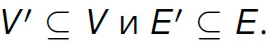
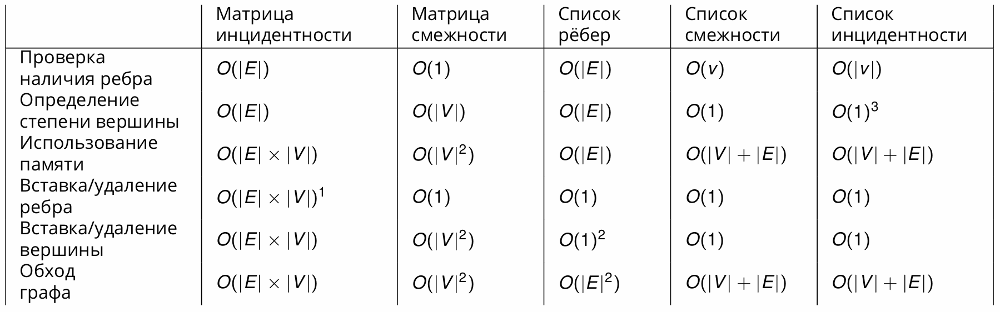

# Что нужно

1) Понятия: графа (ориентированный и неориентированный), смежности, инцидентности, представление в виде списка и матриц (смежности и инцидентности), изоморфизм графов, взвешенные графы, инварианты графов, операции над графами, циклы и пути в графах, деревья.
2) Алгоритмы: поиск в ширину, поиск в глубину, топологическая сортировка (RPO-нумерация с нахождением циклов), поиск критического (самого длинного) пути в графе зависимостей, нахождение компонент сильно связности, построение дерева доминаторов, раскраска графов и нахождение максимального потока на графе.

# Определения

## Граф

* *Граф* - пара множеств G = (V, E), V вершин и E ребер. Множество E задается парой вершин.
* *G' = (V', E')* подграф G = (V, E) если .

## Разные определения

* *Собственным подграфом графа G* - любой подграф G кроме самого графа G.
* Графы могут быть *ориентированными* (дуги упоряд пара e = u -> v = (u, v)) или *неориентированными* (дуги неупоряд. пара e = {u, v})
* Две вершины u, v *смежные* если есть дуга e = u, v. Ребра также могут быть смежными через вершину.
* Дуга e *инцидентна* u, v
* *Степень вершины* v неор. графа число ребер инц. v. Вершина со степенью 0 назыв. *изолированной*. Вершина со степернью 1 назыв. весячей.
* *Степень захода/исхода* - кол. входящих/исходящих дуг в вершину.
* В орграфе. e = (u, v) u - *предшественник* узла v, v - *преемник* узла u.

## Путь и цикл

* *Путь* - последовательность вершин, где каждая смежная пара в цепочке является смеж. в графе.
* *Цепь* - проход по графу, в котором каждое ребро встречается не более одного раза.
* *Циклический путь* - путь, который начинается и заканчивается в одной вершине.
* *Цикл* - в графе это цепь, к-ая начинается и заканчивается на одной вершние.

## Связность

* *Связный граф* - граф, где мжду любой парой вершин существует минимум 1 путь.
* *Сильно связны орграф* - граф, где все вершины сильно связны, т.е. попарно достижимы.
* *Компонента связности графа* - максимально связный подграф графа.

## Дерево

* *Дерево* - связный, ацикл. не орграф., с выделенной вершиной (корень).
* *Остовное дерево* - дерево подграф графа. Моржно получить убрав обратные ребра в циклах.
* *Планарный граф* - граф, к-ый можно изобразить на плоскости без пересечений ребер.
* *Полный граф* - граф, у которого каждый узел соед. с каждым.

# Представления

* *Матрица инцидентности* - строки вершины, столбцы ребра. На пересечение - инцидентность. Знаком можно указать заходит, или выходит ребро.
* *Матрица смежности* - n x n строки/столбцы вершины на пересеч. смежность вершин (количество ребер соед).
* *Список ребер*
* *Список смежности* - каждой вершине соотв. список вершин, которые ей смежны.
* *Список инцидентности* - каждой вершине соотв. список ребер инц. ей.

