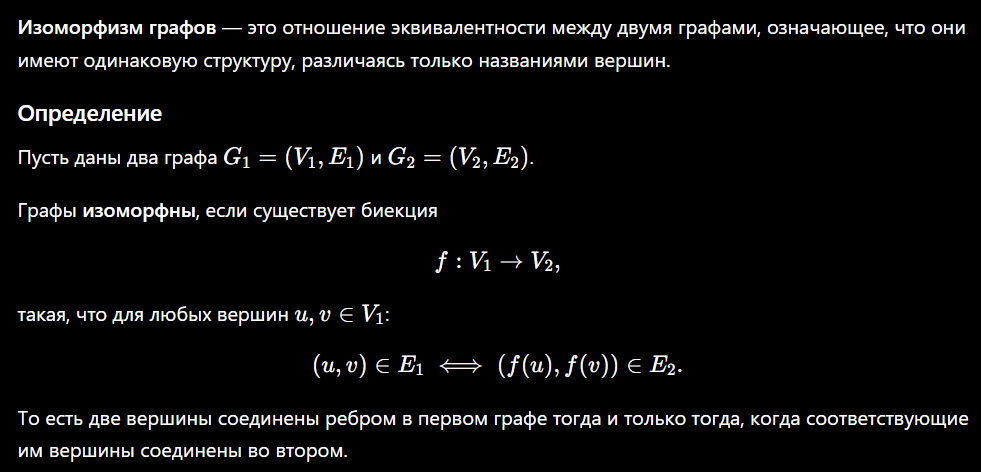
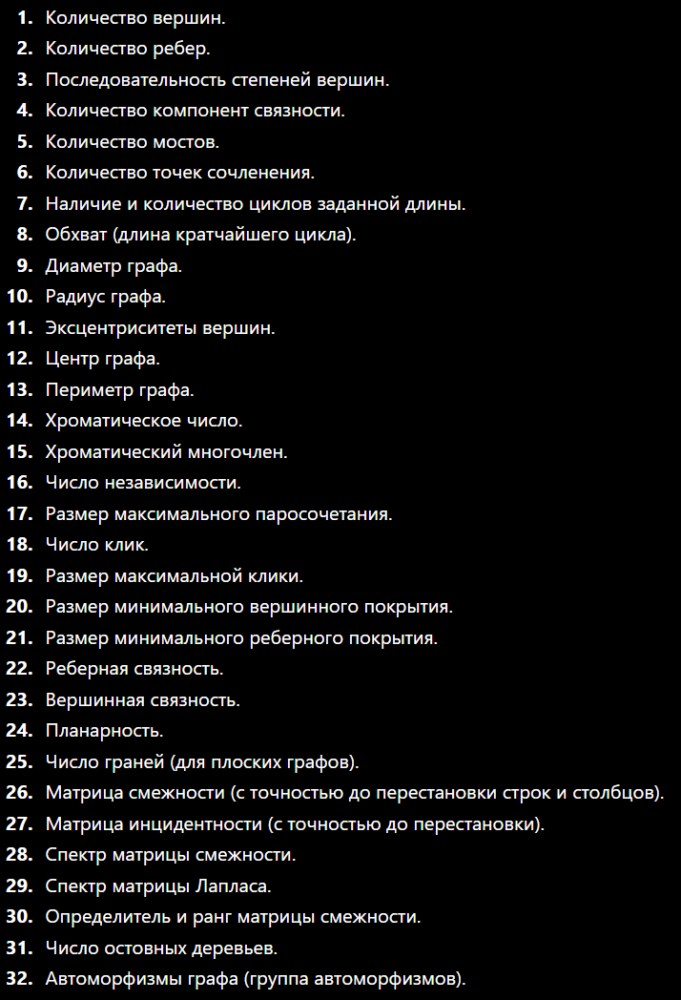

* Понятия: графа (ориентированный и неориентированный), смежности, инцидентности, представление в виде списка и матриц (смежности и инцидентности), изоморфизм графов, взвешенные графы, инварианты графов, операции над графами, циклы и пути в графах, деревья.
* Алгоритмы: поиск в ширину, поиск в глубину, топологическая сортировка (RPO-нумерация с нахождением циклов), поиск критического (самого длинного) пути в графе зависимостей, нахождение компонент сильно связности, построение дерева доминаторов, раскраска графов и нахождение максимального потока на графе.

# Еще понятия

### Изоморфизм графов

### Инварианты графов

**Инварианты графа** — это свойства графа, которые **не изменяются при изоморфизме**. Если два графа изоморфны, то все их инварианты совпадают.

