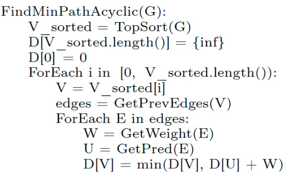

## Взвешенный граф

Граф G называетс взвешенным, если есть ф-ции w: отображает множество ребер на множество вещественных чисел.

Лемма: подпути кратчайших путей есть кратчайшие пути

O(|E|) поиск кратчайших путей для ацикл.:

