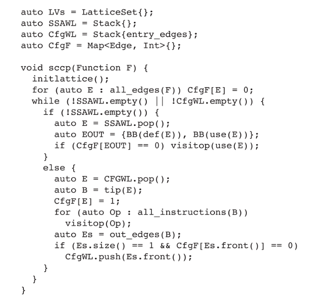
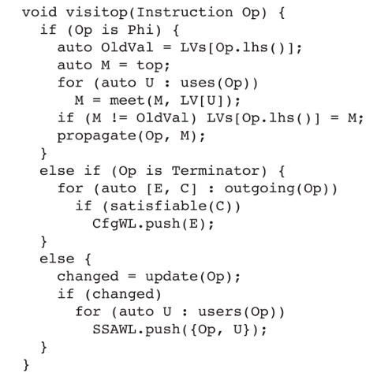
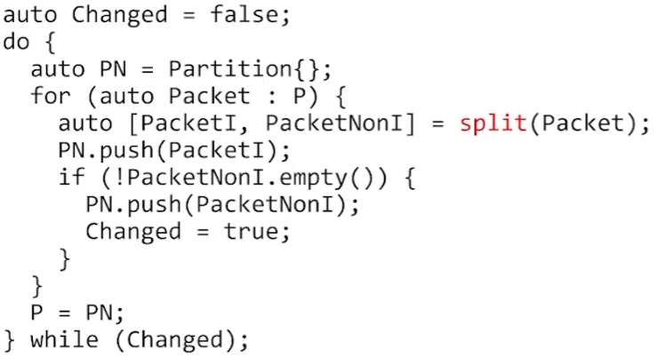
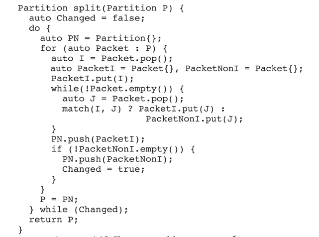

## Решетка

### Бинарное отношение

Отношение, которое ассоцирует элемент своей области опред. с элементом своей области значения и является множеством пар. Далее гомогенное бинарное отношение - эти области совпадают.

xRy (х относится с у как R)

Бинарное отнош. назыв:

* *Рефлексивным*: для любого a aRa
* *Симметричным*: aRb \<-\> bRa
* *Транзитивным*: a, b, c: aRb, bRc -> aRc

### Решетка

Отношение называется *множество частичного порядка* - рефлексивно, a <= b антисемметрично и транзитивно.

Частично упорядоченное множество называют *решеткой (lattice)*, если на нем можно ввести операции пересечения *meet* (a ^ b), и объединения *join* (a join b) таким образом, что:

1. Их результаты тоже принадлежат тому же множеству.
2. a meet (a join b) = a
3. a join (a meet b) = a
4. При этом должны найтись наиб. и наим. элементы: a meet наиб. = a; a join наим. = a.

a join b = элемент, которому предшествуют a и b (least apper bound)

a meet b = элемент, который предшествует a и b (greatest lower bound)

# Constant propagation

## Spare constant propagation

```python
auto LVs = LatticeSet{};
auto WL = Stack{};

void scp() {
    initlattice();
  
    for (auto E : ssa_edges)
        if (LVs[def(E)] != top)
            WL.push(E);
  
    while(!WL.empty()) {
        auto E = WL.pop();
        auto D = def(E), U = use(E);
        auto M = meet(LVs[D], LVs[U]);
        if (M == LVs[U])
            continue;
        LVs[U] = M;
        for (Instruction I : ssa_users(U)) {
            WL.push(ssa_edge(U, I));
            auto OldVal = LVs[I.lhs()];
            auto NewVal = ssa_recompute_def(I.rhs(), U, M);
            LVs[I.lhs()] = NewVal;
            propagate(I, NewVal);
        }
    }
}

void initlattice() {
    for (auto N : ssa_nodes) {
        if (!is_leaf(N)) { LVs[N] = bottom; continue; }
        if (is_const(N)) { LVs[N] = N; continue; }
        LVs[N] = top;
    }
}

void propagate(Instruction I, Value NewVal) {
    if (NewVal is numeral)
        for (auto Val : ssa_users(I))
            replace_uses_with(Val, I, NewVal);
}

```

Подход продвижения констант по ребраз зависимостей по данным.

1. Каждый лист анализируется - если он константа - это его значение константа, иначе он overdefined. Если это не лист то пока он undefined.
2. Строится начальный списко интерес. нас ребер.
3. Решеточная операция выполняется на концами ребра, и записывается в конец использования (meet).
4. Если операция превела к изменению в этом конце, то обновляются все инструкции, использующие результат (ssa_recompute_def + propagate).

* ssa_recompute_def - перевычисяет значение, выражения, в которое входит U.

## Spare condition constant propagation





SCCP не обрабатывает инструкции блока, пока не обнаружено хотя бы одно исполнимое входящее ребро, и не учитывает во φ-функциях значения с неисполняемых рёбер.

## Value Numbering

### Local Value Numbering

Отображение DAG фрагментов (номер) на номер и переменных на номер.

### Global Value Numbering

Сначала:

Пакеты с операндами ф-ции, пакеты по операциям с их результатами.

Нумерация:



Сплитинг:



Замена:

Две инструкции считаются одинаковыми, если они принад -  лежат одному пакету, и все их операнды попарно принадлежат  одинаковым пакетам.

Если инструкции одиноковы, и одна доминирует определение другой, то можно заменить правую часть второй первой.

## DCE

* бимап value - кол. юзеров
* пока есть value в бимап с 0 юзеров
* взять value с 0 юзеров
* уменьшить кол. юзеров у операндов value
* удалить из кода value

## UCE

* бимап бб - кол. входов
* пока есть бб в бимап с 0 входов
* взять бб с 0 юзеров
* уменьшить кол. входов у входных из этого бб
* удалить бб из ф-ции
