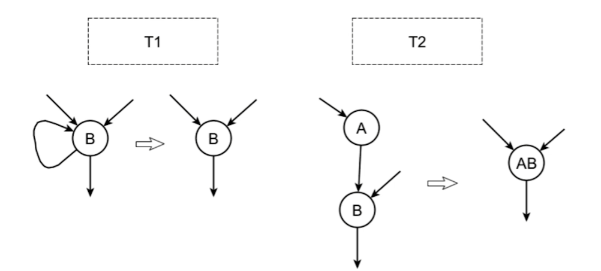
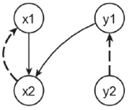

## Естественный цикл

*Обратная дуга* - дуга в которой ее конец доменирует ее начало (m -> n, n dom m)

*Естсественный цикл*, такой подграф в котором:

* m->n обратная дуга
* состоит изо всех узлов, из которых достижима вершина m, если стереть n
* n доменирует надо всеми узлами

## Несводимый цикл

*Обращенная дуга* - m->n: существует RPO: RPO(n) < RPO(m)

Если все обращенные дуги является обратными, то граф *сводимый*, иначе *не сводимый*

В сводимом графе через нумерацию через RPO можно выделить ацикл. граф и совокуп. обратных дуг.

Или T1-T2



## Принятая форма цикла

* Цикл сводимый
* Естественный цикл
* Есть *хедер* - в цикле на обр. дуге m->n, бб n
* Есть *прехедер* - бб из которого идет дуга в хедер, помимо обратной дуги. Для выноса избыточности.
* if do while - if перед прехедером, чтобы учесть случай 0 раз исп. цикла, и чтобы не вычислять избыточности в прехедере.
* Защелка (latch) - бб обратной дуги, где происходит вычисление условия
* exit BB - блок ведущий наружи из цикла (в пограничный блок)
* loop closed SSA (lcssa) - значения опред в цикле, исп. только в цикле или в фи. пограничных блоков.

## Индуктивность

*Индуктивная переменная* (обобщенная индуктивность, generalized induction variable, GIV) - это замкнутый путь в SSA графе, все вершины которого внутри цикла

*Индуктивная переменная (цикла)* - индуктивная переменная, фи узел которой находится в хедере (llvm, и вообще принято)

*Базовая индуктивность* - меняется в цикле 1 раз за итерацию цикла на константу (инвариант).

*Активная индуктивность* - индуктивность, которая участвует в вычислении условия в защелке.

## Инвариант

Инвариант в цикле:

1. Выражение, имеющии завис. от обобщенных индуктивностей цикла.
2. Индуктивная переменная с тривиальной скалярной эволюцией. \<N, +, 0\>, \<M, *,1\>#

# Дерево циклов

....

## Построение дерева циклов

## simple loop invariant code move (LICM)

1. Обходим изнутри дерева циклов наружу
2. Пока changed
3. changed = false
4. Если есть операция, у которой нет операндов объявленных в цикле - вынести операцию; changed = true

## Loop Unroll

Оптимизация вокруг индуктивности.

Переход к другой индуктивности, для которой увеличиваем шаг цикла. Для сокращение количиства условных переходов.

```cpp
// до
for (int i = 0; i < n * 4; ++i) {
  arr[i] = i;
}

// после
for (int i = 0; i < n; ++i) {
  int j = i * 4;
  arr[i] = j;
  arr[j + 1] = j + 1;
  arr[j + 2] = j + 2;
  arr[j + 3] = j + 3;
}


// если не знаем про границу цикла, тоже можем раскрутить
// до
for (int i = 0; i < n; ++i) {
  arr[i] = i;
}

// после
if (n > 0) {
  for (int i = 0; i + 3 < n; i += 4) {
    arr[i] = i;
    arr[i + 1] = i + 1;
    arr[i + 2] = i + 2;
    arr[i + 3] = i + 3; 
  }

 switch (n % 4) {
   case 3: arr[n - 3] = n - 3; 
   case 2: arr[n - 2] = n - 2; 
   case 1: arr[n - 1] = n - 1;
 }

}
```

## Loop peeling

Оптимизация вокруг инваринта.

*Квази-инвариант* - инвариант, который становится таковым после определенного количества циклов

Loop peeling - разбиение цикла по ренджу, с расскруткой одной части разбиения. Нужно для выноса квази инвариантов.

```cpp
// do
if (n > 1) {
  i = 1;
  do {
    a[i] = a[1] + i;
    i += 1;
  } while (i < n);
}

// posle
if (n > 1) {
  a1 = a[1] + 1;
  a[1] = a1;
  if (n > 2) {
    i = 2;
    do {
      a[i] = a1 + i;
      i += 1;D
    } while (i < n);
  }
}

```

Поиск квази-инвариантов:

* True SSA dep: x in def y, x dom y
* Antrue SSA dep: x in def y; y dom x
* Для всех ssa перемен. true и anti dep, строится двусортный граф по dep - variable dependency graph (VDG)
* Берем вершину (соотв. phi-узлу). Если по всем путям, конч. в этой вершине нет вершин из связных компонентов, то это квази-инвариант.

  

  тут y1

## Loop spletting

Структурная оптимизация.

Разбиение цикла по пространству его итераций.

```cpp
// do
for (int i = 0; i < n; ++i) {
  if (i < m) smth();
  other();
}

// posle
int k = min(n, m);

for (int i = 0; i < k; ++i) {
  smth();
  other;
}

for (int i = m; i < n; ++i) {
  other();
}

```

## Loop distrubution (fission) (Распределение цикла)

Структурная оптимизация.

Разбиение тела цикла.

```cpp
// do
for (int i = 0; i < n; ++i) {
  a[i] = i;
  b[i] = i;
}

// posle
for (int i = 0; i < n; ++i) {
  a[i] = i;
}

for (int i = 0; i < n; ++i) {
  b[i] = i;
}
```

\+ для кеш-локальности. Где-то можно сделать memset.

## Loop fusion (jam) (Слияния цикла)

Структурная оптимизация.

Слияния тела цикла.

```
// do
for (int i = 0; i < n; ++i) {
  a[i] = i;
}

for (int i = 0; i < n; ++i) {
  b[i] = 0;
}

// posle
for (int i = 0; i < n; ++i) {
  a[i] = 0;
  b[i] = i;
}
```

Тут компилятор,  будет понимать что тут memset(0) 2 раза, а не memset и потом memcopy
