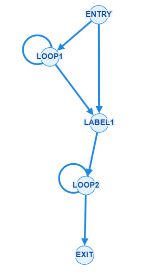

# Матвеев С.А. Вариант 2.

# Теоретические вопросы

### №1

* Bj доминирует Bi (Bj dom Bi), если и только если Bj располагается на любом пути от entry к Bi.
* Каждый узел доминирует сам себя.
* Bj строго доминирует Bi, если Bj dom Bi и Bj != Bi.
* Bj непосредственно доминирует Bi, если Bj строго доминирует Bi и Bj является ближайшим к Bi доминатором к Bj по всем путям от entry.

Дерево доминаторов:

```python
DomTree = Graph{};
for (auto [I, Domset] : Dom) {
    Domset = exclude(Domset, I)
    if (empty(Domset))
        continue;
    if (size(Domset) == 1) {
        add(DomTree, tie(head(Domset), I))
        continue;
    }
    auto J = closest(Domset, I);
    add(DomTree, tie(J, I))
}

```

* Фронтом доминирования (dominance frontier)  для блока Вn, называется множество всех блоков Вm, таких, что Вn, доминирует хотя бы одного из предков Bm и Вn, не является строгим доминатором Вm.
* Для построения SSA фронт доминирования используется для расстановки phi-узлов. Если переменная x определяется в блоке **B**, то phi для x нужно поставить в блоках из **D**F(**B**). Затем повторить для новых блоков с phi - итерирование фронта доминирования.

### №2

* Частный случай перехода к новой индуктивности.
* Раскрутка цикла - объединение нескольких итераций цикла, чтобы уменьшить число переходов и открыть больше возможностей для оптимизации.
* Изменение количества итераций зависит от переменной цикла. Например, если она кратна 4м, можно объединить 4 итерации. Однако, даже если переменная не кратна числу, тоже можно объединить несколько итерации, с дальнейшей проверкой остатка после цикла.
* **Отделение итераций** позволяет вынести особые первые итерации и, например, выровнять обращения к памяти.
* Досчётный цикл обрабатывает остаток, если число итераций не кратно ширине вектора.
* Раскрутка предоставляет векторизатору группы однотипных независимых операций и повышает параллелизм.

### №3

* Локальные алгоритмы работают только внутри одного бб. Глобальные рассматривают весь CFG функции: передают информацию между бб, объединяют её в точках слияния, для циклов ищут неподвижную точку.
* Локальное продвижение: в одном бб %x = 3; %y = %x + 2 преобразуется в %y = 5. Глобальное: %x = 3 определяется в бб, а используется в другом. Либо одинаковые константы из нескольких ветвей объединяются в phi.
* Продвижение и свёртку можно выполнять одновременно: найденную константу используют при вычислении значения на решетки пользователя, также можно свернуть выражение из констант в листе def-use графа, при инициализации решетки и worklist.
* Одновременно можно упрощать условные переходы, выявлять недостижимые блоки. Учёт достижимых ветвей выполняет SCCP.

### №4

* Компилятор анализирует зависимости и псевдонимы памяти, после чего объединяет width независимых итераций. Скалярные загрузки, операции и сохранения заменяются векторными, шаг индуктивной переменной увеличивается в width раз.
* Накладные расходы создают проверки пересечения и выравнивания массивов, отделённые и остаточные итерации, маскирование, горизонтальная обработка редукций, рост кода и давление на регистры. Поэтому векторизация может замедлить короткие циклы, циклы с нерегулярным доступом, ветвлениями, зависимостями или большим числом spill-операций.

```python
bool V(LoopParameters loopParameters, int width) {
    auto loop = loopParameters.loop;
    // frequency - оцнека того, сколько раз программа войдет в цикл
    // tripCount - оценка того, сколько итераций будет в цикле
    auto scalarTime = frequency(loop) * tripCount(loop) * scalarIterationCost(loop);
    auto vectorTime = frequency(loop) * totalVectorCost(loop, width);
    auto deltaExec = scalarTime - vectorTime;
    auto deltaComp = vectorizationCompileCost(loop, width);
    return deltaExec > 0 && deltaExec > deltaComp;
}
```

# Задача

### № 1 CFG

main():

!

foo():


exit для того, чтобы понять где RET

## PHI

### dom

dom(entry) = {entry}

dom(loop1) = {loop1, entry}

dom(label1) = {label1, entry}

dom(loop2) = {loop2, label1, entry}

### df

df(entry) = {}

df(loop1) = {loop1, label1}

df(label1) = {}

df(loop2) = {loop2}

### Итерирование df с учетом liveIN[]

LiveIN - если переменная жива на входе в бб, то вставляем для нее phi

### foo - не меняется

### main

```armasm
main():
ENTRY:
MOV 2 -> r1
MOV 3 -> r2
MUL r1 r2 -> r3
ADD r3 1 -> r4
CMPZ r4 -> p1
BRANCH p1 LABEL1
MUL r1 r2 -> r5
MOV 0 -> r6


LOOP1:
PHI ([r2, ENTRY], [r2, LOOP1]) -> r2
PHI ([r6, ENTRY], [r6, LOOP1]) -> r6
CALL foo r1 r2 -> r7
ADD 1 r7 -> r2
ADD r6 1 -> r6
CMPL r6 N -> p2
BRANCH p2 LOOP1
ADD r5 r2 -> r5


LABEL1:
PHI ([r2, ENTRY], [r2, LOOP1]) -> r2
MOV 0 -> r6

LOOP2:
PHI ([r2, LABEL1], [r2, LOOP2]) -> r2
PHI ([r6, LABEL1], [r6, LOOP2]) -> r6
CALL foo r1 r1 -> r8
ADD r2 r8 -> r2
ADD r6 1 -> r6
CMPL r6 N -> p2
BRANCH p2 LOOP2
RET r2
RET r4
```

## rename

### foo

```armasm
foo():
PARAMETERS: r1_1, r2_1
MOV 0 -> r3_1
MUL 2 r1_1 -> r3_2
MUL 2 r2_1 -> r4_1
ADD r3_2 r4_1 -> r3_3
ADD r1_1 r2_1 -> r5_1
MUL r1_1 r5_1 -> r6_1
RET r6_1
```

### main

```armasm
main():
ENTRY:
MOV 2 -> r1_1
MOV 3 -> r2_1
MUL r1_1 r2_1 -> r3_1
ADD r3_1 1 -> r4_1
CMPZ r4_1 -> p1_1
BRANCH p1_1 LABEL1
MUL r1_1 r2_1 -> r5_1
MOV 0 -> r6_1

LOOP1:
PHI ([r2_1, ENTRY], [r2_3, LOOP1]) -> r2_2
PHI ([r6_1, ENTRY], [r6_3, LOOP1]) -> r6_2
CALL foo r1_1 r2_2 -> r7_1
ADD 1 r7_1 -> r2_3
ADD r6_2 1 -> r6_3
CMPL r6_3 N -> p2_1
BRANCH p2_1 LOOP1
ADD r5_1 r2_3 -> r5_2

LABEL1:
PHI ([r2_1, ENTRY], [r2_3, LOOP1]) -> r2_4
MOV 0 -> r6_4

LOOP2:
PHI ([r2_4, LABEL1], [r2_6, LOOP2]) -> r2_5
PHI ([r6_4, LABEL1], [r6_6, LOOP2]) -> r6_5
CALL foo r1_1 r1_1 -> r8_1
ADD r2_5 r8_1 -> r2_6
ADD r6_5 1 -> r6_6
CMPL r6_6 N -> p2_2
BRANCH p2_2 LOOP2
RET r2_6
RET r4_1
```
